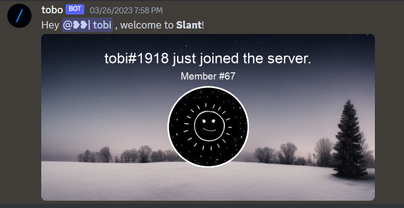
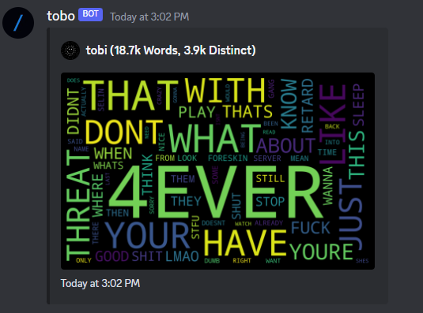
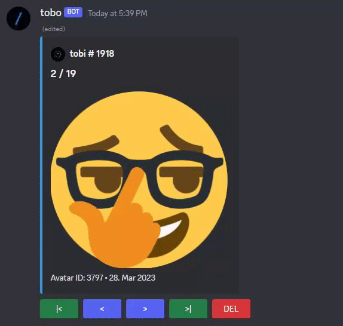

#Discord Bot - Python
This is a Discord bot written in Python for a server with a group of friends and friends of friends. The bot is designed to make the server more fun and engaging by providing a range of useful features and commands.

Features
##Welcome Message with AI Background Pictures
Sends a welcome message to each new member who joins the server. The message includes a picture that features the avatar and name of the joined member. The bot uses a random picture out of 30 AI made background pictures to create the welcome message.

##Wordcloud Command
Creates a wordcloud of the words used by a member on the server. This command is useful for analyzing the most commonly used words.

##Avatar History Command
Showcases the profile pictures used by a member since joining the server. 

