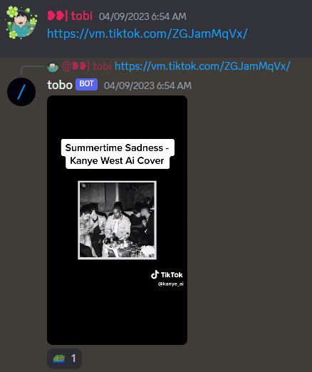
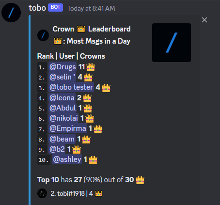
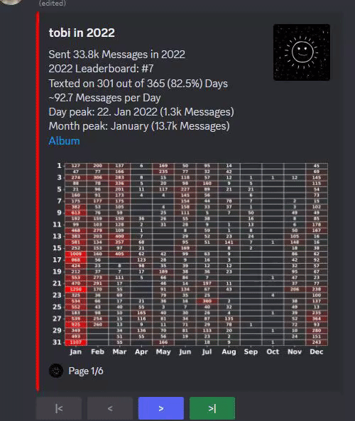
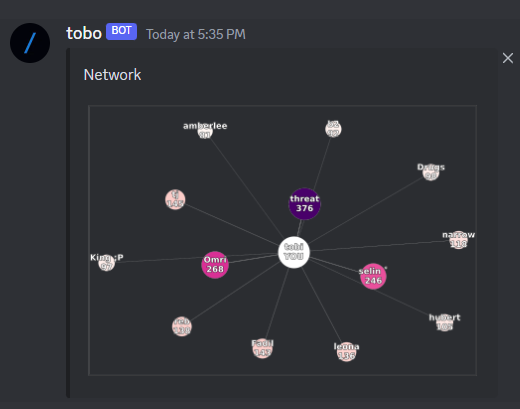
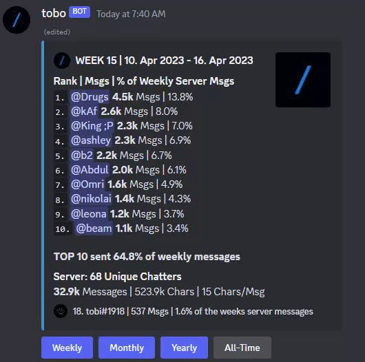
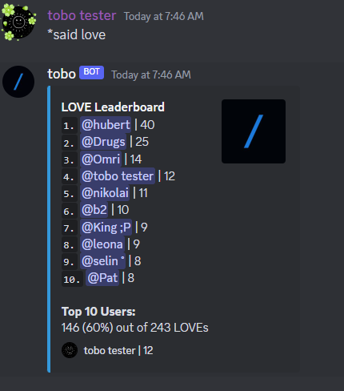
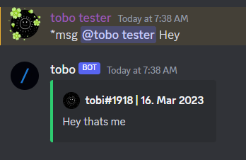
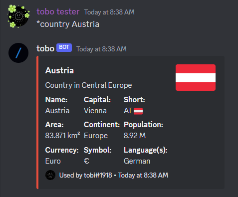

# Discord Bot - Python
This is a Discord bot written in Python for a server with a group of friends and friends of friends. The bot is designed to make the server more fun and engaging by providing a range of useful features and commands.

Features
## Welcome Message with AI Background Pictures
Sends a welcome message to each new member who joins the server. The message includes a picture that features the avatar and name of the joined member. 

## TIKTOK Donwloader
Automatically downloads any TikTok links and post the video as reply to the original message. This way, you dont have to open the link to view the video. 

The bot uses a random picture out of 30 AI made background pictures to create the welcome message.

## Chat Leaderboard
Showcases Members with most messages in a time period (weekly, monthly, yearly or all-time)

## Crowns
Shows a leaderboard of members with the most crowns.
You obtain a crown for every day you were the member with most messages sent.

## Wordcloud
Creates a wordcloud of the words used by a member on the server. This command is useful for analyzing the most commonly used words.

## Avatar History 
Showcases the profile pictures used by a member since joining the server. 

## Rewind
Showcases various chat stats graphically including most active weekday of the week, time of the day etc..

## Network
Showcases a network graph with members who chat at similar times as the member.

## User Messages Peak Leaderboard
Showcases messages peaks by members within a timeframe (most messages in one day, one week, one month, one year by a single member))

## Snipe
Showcases last deleted message in text channel.

## Said
Shows a leaderboard of members who used a particular word the most.

## Msg
Finds a random past message (by a member containing a word/phrase)

## Country
Shows basic information about a country.

