# Slant Server Discord BOT
This is a Discord bot written in Python for a server with a group of friends and friends of friends. The bot is designed to make the server more fun and engaging by providing a range of useful features and commands.

# Features
The BOT has around 60 different commands and features which include very basic (like USERINFO, SERVERINFO, AVATAR, KICK, BAN, etc.) and many unique and server dedicated ones.  
Some of which are showcased in the next chapter.  
[Command List](README/command_list.txt)

## Welcome Message with AI Background Pictures
Posts a welcome picture including the name and avatar of the newly joined member.

The bot uses a random picture out of 25 AI made background pictures to create the welcome message.

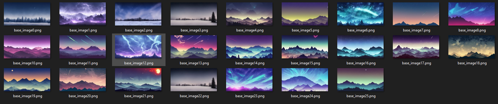

## TIKTOK Downloader
Automatically downloads any TikTok links and posts the video as reply to the original message within seconds. This way, the sent TikTok is viewable directly on Discord.

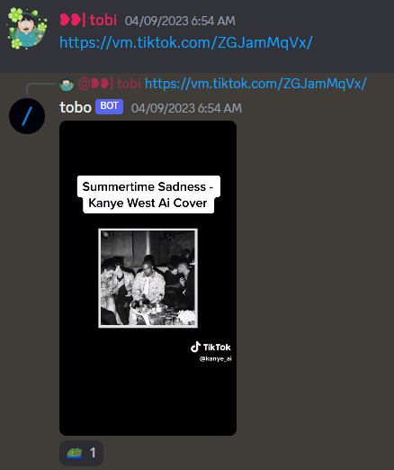

## Monthly Chat Leaderboard Updates
On the 1st day of every month, the previous month's top 20 chatters are showcased.

## Chat Leaderboard
Showcases Members with most messages in a time period (weekly, monthly, yearly or all-time)

## Crowns
Shows a leaderboard of members with the most crowns.
You obtain a crown for every day you were the member with most messages sent.

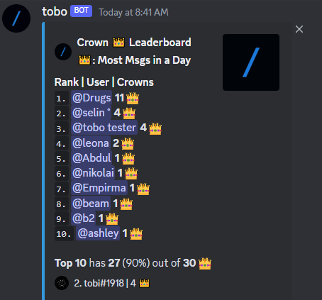

## Wordcloud
Creates a wordcloud of the words used by a member on the server. This command is useful for analyzing the most commonly used words.

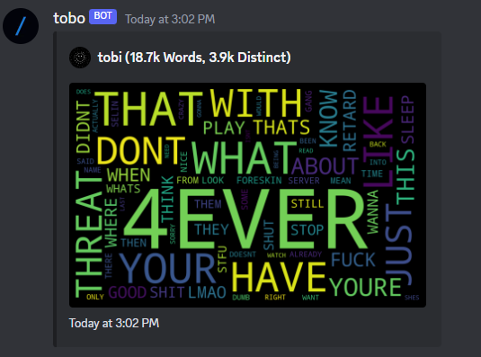

## Avatar History 
Showcases the profile pictures used by a member since joining the server. 

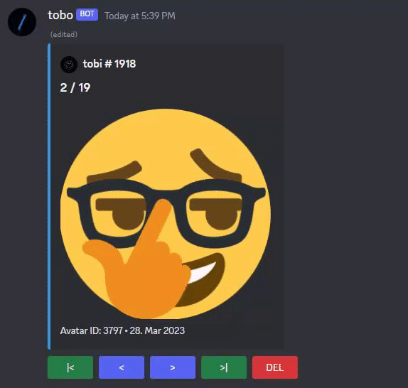

## Rewind
Showcases various chat stats graphically including most active weekday of the week, time of the day etc..

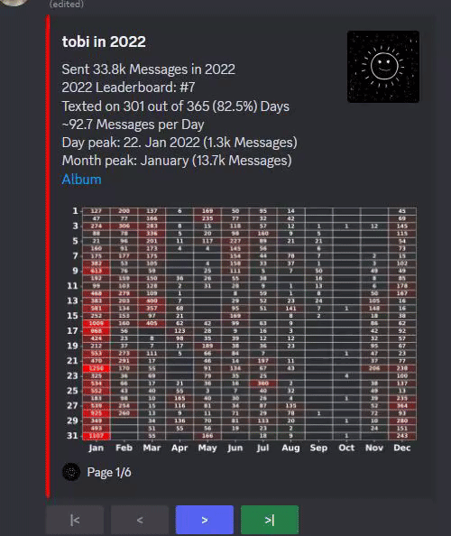

## Serverpeaks
Showcases the days, weeks, months and years where most messages were sent.

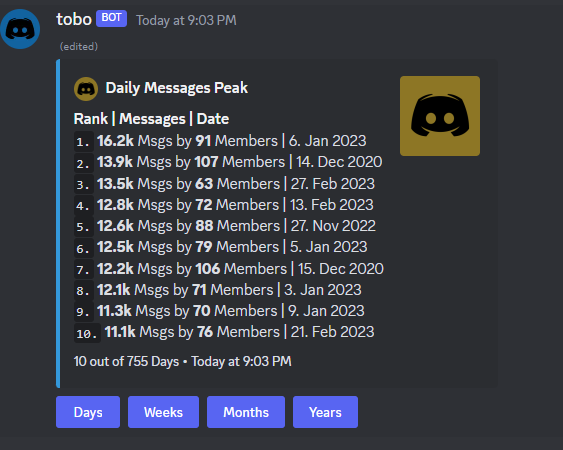

## Network
Showcases a network graph with members who chat at similar times as the member.

## User Messages Peak Leaderboard
Showcases messages peaks by members within a timeframe (most messages in one day, one week, one month, one year by a single member))

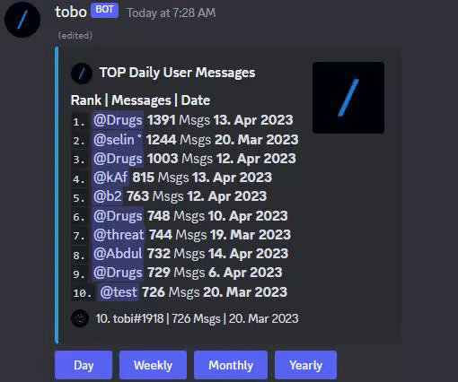

## Snipe
Showcases last deleted message in used text channel.

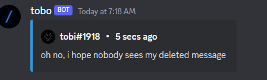

## Said
Shows a leaderboard of members who used a particular word the most.

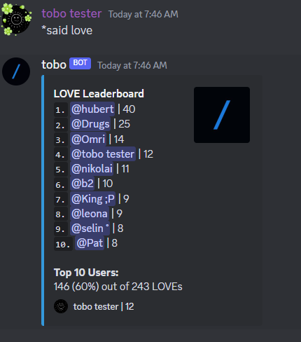

## Msg
Finds a random past message (by a member containing a word/phrase)

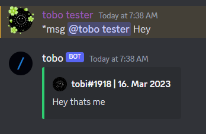

## Country
Shows basic information about a country.

# HOW TO INSTALL

## 1. Clone repository 
`git clone https://github.com/towbyxo3/slant-python-discord-bot.git`
## 2. Install packages 
`pip install -r requirements.txt`
## 3. Create a new Discord server
The new server is used to store various picture links.
It's recommended to create text channels named "avatar_history_images" and "rewind_images" which will act as storage.  
## 4. Modify config.json
Insert your bots token and your ID into the config.json file and modify bot display settings.
Fill out the rest of the JSON file. 
## 5. Run the BOT.
`python3 index.py`  
or  
`python index.py`

Add tobi#1918 on Discord if you need help.

