# Slant Server Discord Bot

Slant Server Discord Bot is a Python-based Discord bot designed to enhance the fun and engagement of a server with a group of friends and friends of friends. This bot offers a variety of useful features and commands.

## Table of Contents
- [Installation](#how-to-install)
- [Features](#features)
  - [Welcome Message](#welcome-message)
  - [TIKTOK Downloader](#tiktok-downloader)
  - [Monthly Chat Leaderboard Updates](#monthly-chat-leaderboard-updates)
  - [Chat Leaderboard](#chat-leaderboard)
  - [Crowns](#crowns)
  - [Mention Leaderboard](#mention-leaderboard)
  - [Wordcloud](#wordcloud)
  - [Avatar](#avatar)
  - [Server Info](#server-info)
  - [User Info](#user-info)
  - [Rewind](#rewind)
  - [Chat Peaks](#chat-peaks)
  - [Network](#network)
  - [Age Leaderboard](#age-leaderboard)
  - [Snipe](#snipe)
  - [Said](#said)
  - [Quote](#quote)
  - [Country](#country)

# How to Install
1. Clone the repository: `git clone https://github.com/towbyxo3/slant-python-discord-bot.git`
2. Install required packages: `pip install -r requirements.txt`
3. Create a new Discord server: This server will be used to store various picture links. It is recommended to create text channels named "avatar_history_images" and "rewind_images" to act as storage.
4. Modify config.json: Insert your bot's token and your ID into the config.json file, and modify the bot's display settings. Fill out the rest of the JSON file.
5. Run the bot: Execute `python3 index.py` or `python index.py`.

If you need any assistance, feel free to add *tobi#1918* on Discord.

# Features

The Slant Server Discord Bot offers approximately 60 different commands and features, including both basic commands (such as USERINFO, SERVERINFO, AVATAR, KICK, BAN, etc.) and unique server-dedicated ones. The following are some of the showcased features:

[Command List](README/command_list.txt)

## Welcome Message
Posts a welcome picture that includes the name and avatar of newly joined members.

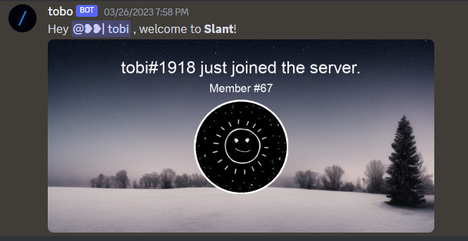

## TIKTOK Downloader
Automatically downloads and posts any TikTok video link as a reply to the original message within seconds, making it viewable directly on Discord.

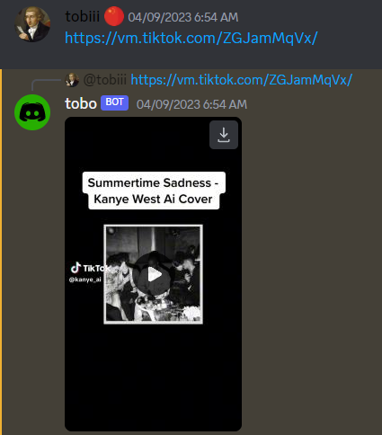

## Monthly Chat Leaderboard Updates
On the 1st day of every month, the bot showcases the top 20 chatters from the previous month.

## Chat Leaderboard
Displays a leaderboard of members with the most messages during 4 current time periods:
- Weekly
- Monthly
- Yearly
- All-time

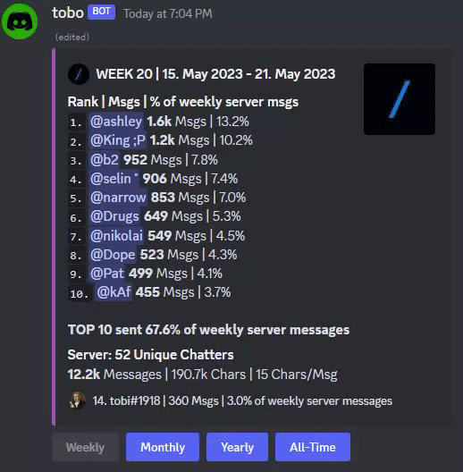

## Crowns
Shows a leaderboard of members with the most crowns. Members earn a crown for every day they have the highest number of sent messages.

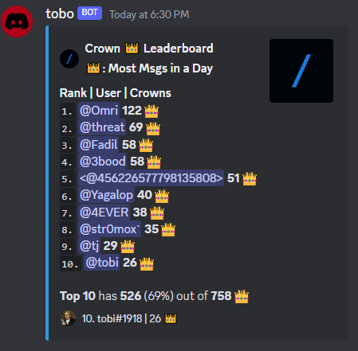

## Mention Leaderboard
Shows a leaderboard of:
- Members with the most mentions
- Members who mention that specific member the most
- Members who are mentioned the most by that specific member

 by a specific member

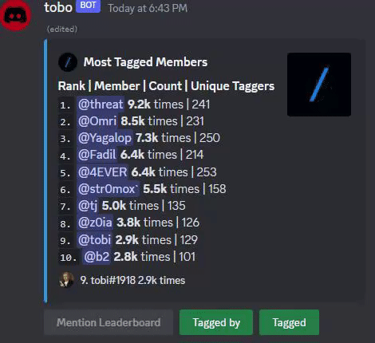

## Wordcloud
Generates a word cloud of the most frequently used words by:  

A specific member  

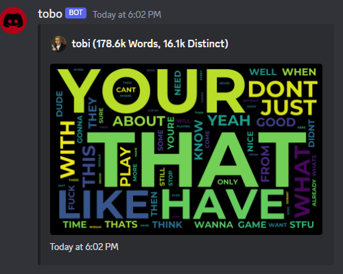

The entire server  

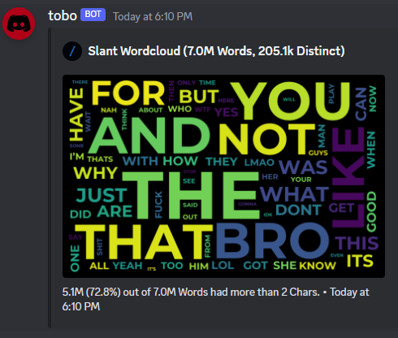

## Avatar
Displays the current and past profile pictures of members, both global and server-specific, since joining the server.

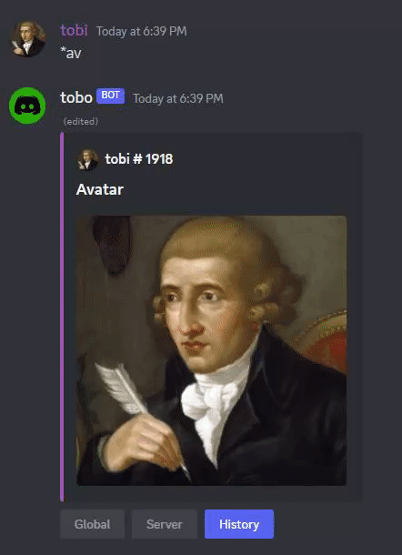

## Server Info
Shows information about the server, including the option to display the server icon and banner.

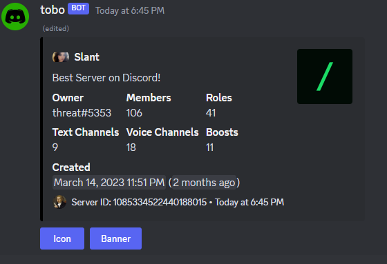

## User Info
Displays information about a user.

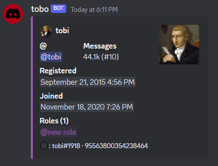

## Rewind
Displays chat statistics and data graphically for a selected year of a member or the entire server.

Features:
- Calendar heatmap with message count for every day
- Bar chart of messages per month
- Month heatmap with message count
- Hour of the weekday heatmap with message count
- Hour of the day heatmap with message count
- Bar chart of messages per weekday

Includes a clickable link to a gallery that contains all six graphics, ensuring permanent availability of the statistics.

User Example  
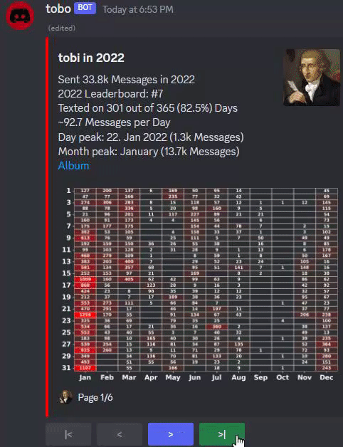  
[Album Link Example](https://cdn.discordapp.com/attachments/1096666873615089694/1105904117274132592/rewind_gallery_user.png)

Server Example  
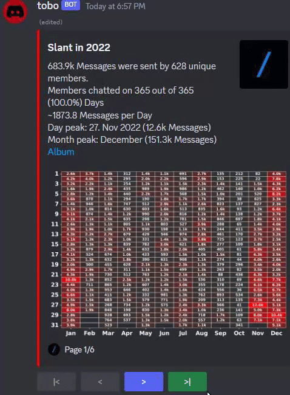

## Chat Peaks
Shows a leaderboard of timeframes in which a member or the server sent the most messages.

Timeframes:
- Day
- Week
- Month
- Year

User Example  
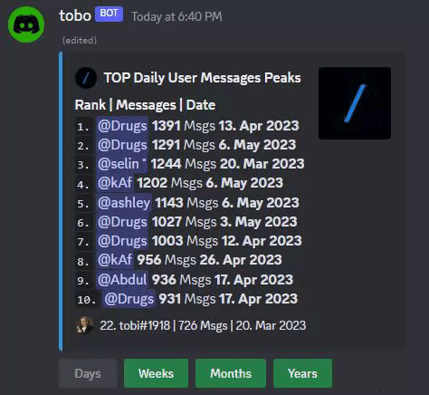

Server Example  
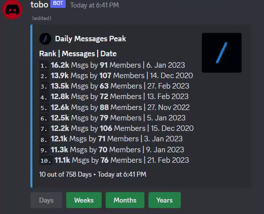

## Network
Visually represents the most frequent chat encounters between members. The numbers on the graph indicate the number of times the member and the other person chatted within the same 5-minute time frame.

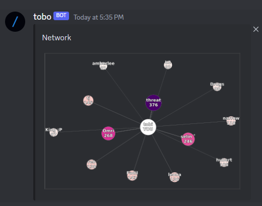

## Age Leaderboard
Displays the oldest or youngest members in the server based on:
- Discord registration date
- Server join date

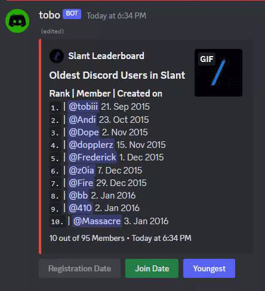

## Snipe
Shows the last deleted message in the specified text channel.

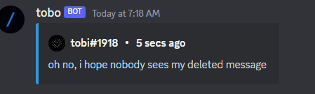

## Said
Displays a leaderboard of members who used a particular word the most.

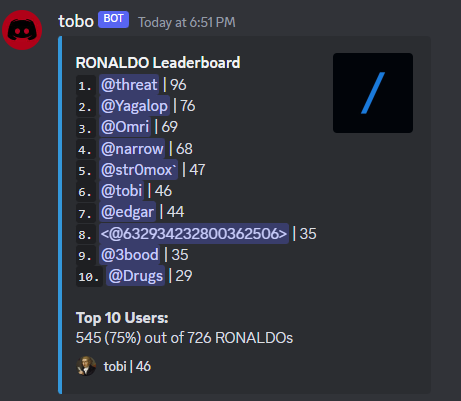

## Quote
Retrieves a random past message by a member containing a specific word or phrase.

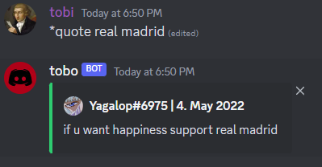

## Country
Shows COVID-19 statistics of a specific country.

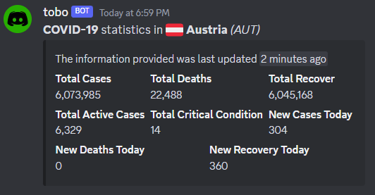

## Country Info
Provides basic information about a country.

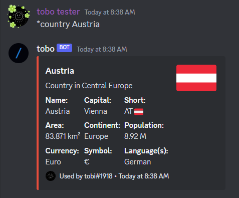