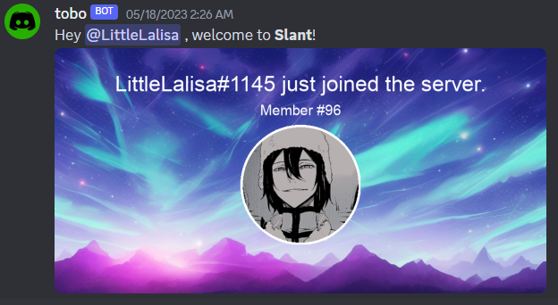

# Slant Server Discord BOT
This is a Discord bot written in Python for a server with a group of friends and friends of friends. The bot is designed to make the server more fun and engaging by providing a range of useful features and commands.

## Table of Contents
- [How to Install](#how-to-install)
- [Features](#features)
  - [Welcome Message with AI Background Pictures](#welcome-message)
  - [TIKTOK Downloader](#tiktok-downloader)
  - [Monthly Chat Leaderboard Updates](#monthly-chat-leaderboard-updates)
  - [Chat Leaderboard](#chat-leaderboard)
  - [Crowns](#crowns)
  - [Mention Leaderboard](#mention-leaderboard)
  - [Wordcloud](#wordcloud)
  - [Avatar](#avatar)
  - [Serverinfo](#serverinfo)
  - [Userinfo](#userinfo)
  - [Rewind](#rewind)
  - [Chat Peaks](#chat-peaks)
  - [Network](#network)
  - [Age Leaderboard](#age-leaderboard)
  - [Snipe](#snipe)
  - [Said](#said)
  - [Quote](#quote)
  - [Country](#country)

## How to Install
1. Clone the repository: `git clone https://github.com/towbyxo3/slant-python-discord-bot.git`
2. Install packages: `pip install -r requirements.txt`
3. Create a new Discord server: The new server is used to store various picture links. It's recommended to create text channels named "avatar_history_images" and "rewind_images" which will act as storage.
4. Modify config.json: Insert your bot's token and your ID into the config.json file and modify bot display settings. Fill out the rest of the JSON file.
5. Run the BOT: `python3 index.py` or `python index.py`

Add tobi#1918 on Discord if you need help.

# Features

The BOT has around 60 different commands and features which include very basic (like USERINFO, SERVERINFO, AVATAR, KICK, BAN, etc.) and many unique and server-dedicated ones.  
Some of which are showcased in the next chapter.  
[Command List](README/command_list.txt)

## Welcome Message
Posts a welcome picture including the name and avatar of the newly joined member.

## TIKTOK Downloader
Automatically downloads any TikTok links and posts the video as a reply to the original message within seconds. This way, the sent TikTok is viewable directly on Discord.

## Monthly Chat Leaderboard Updates
On the 1st day of every month, the previous month's top 20 chatters are showcased.

## Chat Leaderboard
Showcases Members with the most messages in the current time period:
- weekly
- monthly
- yearly
- all-time

## Crowns
Shows a leaderboard of members with the most crowns. You obtain a crown for every day you were the member with the most messages sent.

## Mention Leaderboard
Shows a leaderboard of:
- members with the most mentions
- the members who mention a specific member the most
- members who are mentioned the most by a specific member

## Wordcloud
Creates a word cloud of the most frequently used words by:
- a member
  
- the server
  

## Avatar
Showcases the profile pictures (global and server) currently used and since joining the server.

## Serverinfo
Shows server information with the option to display the server icon and banner.

## Userinfo
Showcases the profile pictures currently used and since joining the server.

## Rewind
Showcases chat stats and data graphically of a selected year for a member or the server.

Features:
- Calendar heatmap with message count for every day visualized
- Bar chart of messages per month
- Month heatmap with message count for every month visualized
- Hour of the weekday heatmap with message count visualized
- Hour of the day heatmap with message count visualized
- Bar chart of messages per weekday

Has a clickable link that links to a gallery created out of all 6 graphics and guarantees permanent availability of the stats.

User:

[Album Link example](https://cdn.discordapp.com/attachments/1096666873615089694/1105904117274132592/rewind_gallery_user.png)

Server:

## Chat Peaks
Shows a leaderboard of timeframes where a member or the server sent the most messages.

Time frames:
- day
- week
- month
- year

User:

Server:

## Network
Visually showcases the most frequent chat encounters of. The numbers on the graph indicate the number of times that the member and the other person chatted within the same 5-minute time frame.

## Age Leaderboard
Showcases oldest or youngest members in Server by:
- Discord Registration Date
- Server Join Date

## Snipe
Showcases the last deleted message in the used text channel.

## Said
Shows a leaderboard of members who used a particular word the most.

## Quote
Finds a random past message (by a member containing a word/phrase).

## Country
Shows COVID-19 stats of a country.

## Country
Shows basic information about a country.

